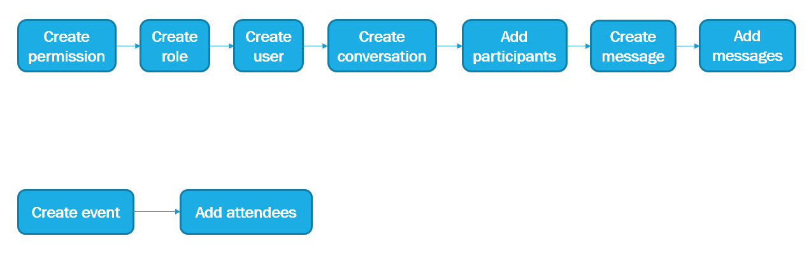
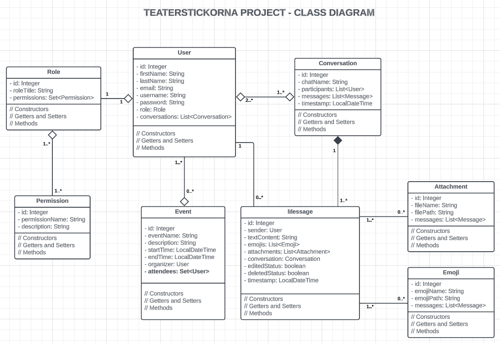
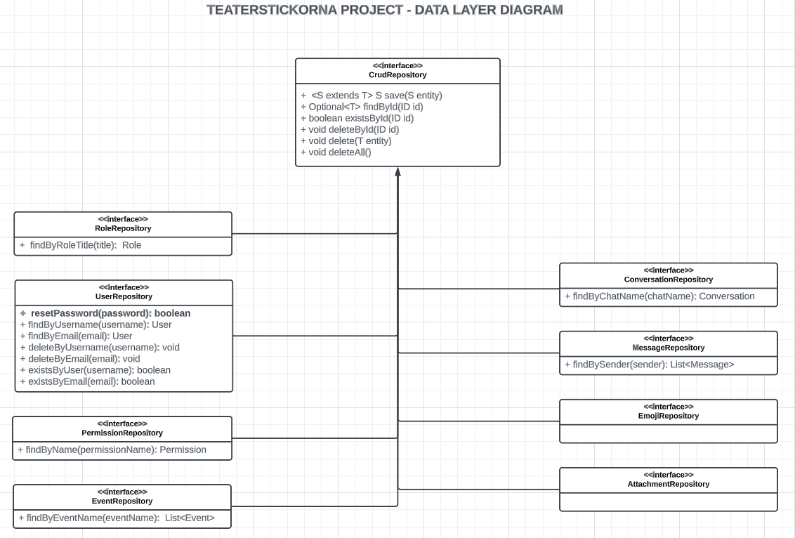
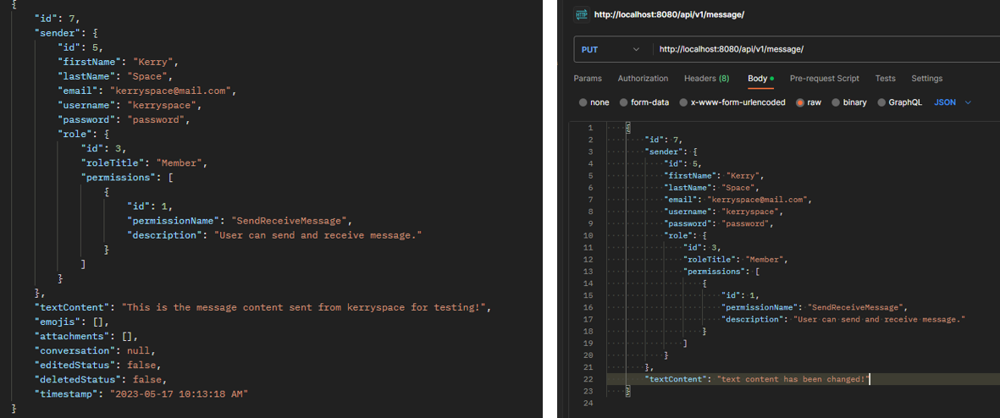
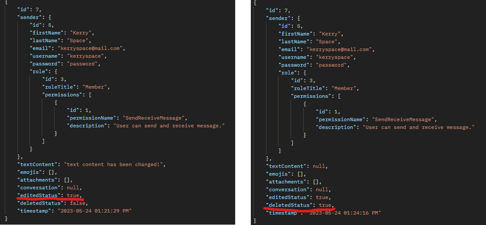

# TEATERSTICKORNA PROJECT

- Creating a web application for internal communication with basic chat functions which can send attachments, send/receive messages. 
- In additional, user can create an event/meeting schedule and add attendees.

## DATABASE INIT
- After run the application, we need to init the database with the following orders:

- NOTE: Do NOT add conversations/messages field to user. After create a conversation, we will add users and messages to that conversation later on, so it will auto update conversations/messages in user object. Please follow the above orders.

## CLASS DIAGRAM

## DATA LAYER DIAGRAM

## RESTAPI USAGES NOTE

- After creating a blank conversation, we need to add participants first (because only user in this participants list can send/receive messages in this conversation).
- Add participant request can be done by the following syntax:
  http://localhost:8080/api/v1/conversation/3/participant/1 
- Explanation: with the above syntax, we will add user with userId = 1 to conversation with conversationId = 3.
- Similar syntax can be used to delete a participant, add/delete messages from a conversation.

## REMAINING TASKS

- Websocket implementation for server-client communication optimization and broadcast new messages to all participants in that conversation.
NOTE: Using Spring websocket.
- Available functions that need implementation from FE: when a message is edited or deleted, the status of that message will be changed as following:

- Adding emojis
- Send/receive attachments.
- Add/Remove attendees for an event/meeting schedule.

- Github link to the project: https://github.com/SonNghi3m/TEAT.git
